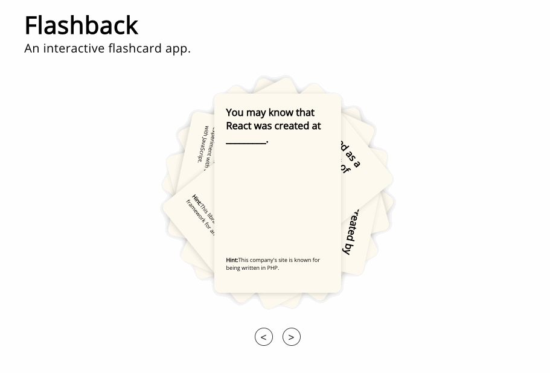

(See screenshots below.)

* The challenge: Create an app that would enable users to learn basic facts about React in an engaging, interesting way.

* The solution: A dynamic React-based app which presents a series of flash cards, each with a question about ReactJS on the front of the card and the answer on the back of the card.

* Features:
     *  Cards appear initially spread out in a pile with only the top card readable, to engage user curiosity ("What's on the other cards?").

     * The front of each card shows a question and a hint to help the user answer the question (and further build user interest).
     

     * When the user clicks on the top card, it flips to show the back.

     * On the back are the answer to the question on the front of the card and a colorful image 
     to build engagement and improve user experience.

     * Buttons below the pile of cards move ahead or back one card. 

     * All navigation is fully inuitive: users do not need "Instructions" to know how to use the app.

* Technology:
     * Content is rendered to an HTML page.

     * Content is JSX generated by ReactJS 16.0.0 components using react-dom 16.0.0, compiled to JavaScript by babel 6.26.0.

     * Styling is controlled by a separate CSS file.

     * Images are stored with the program files.

     * A tutorial for building the app is available from TheFirehoseProject.com
